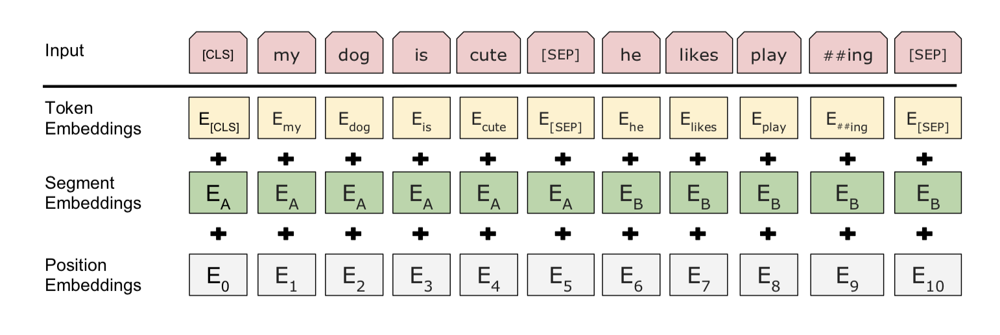
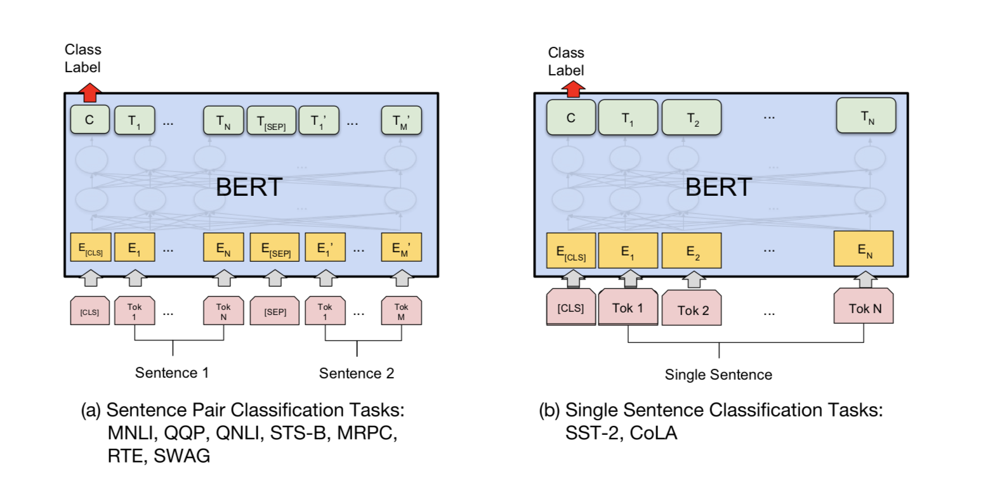
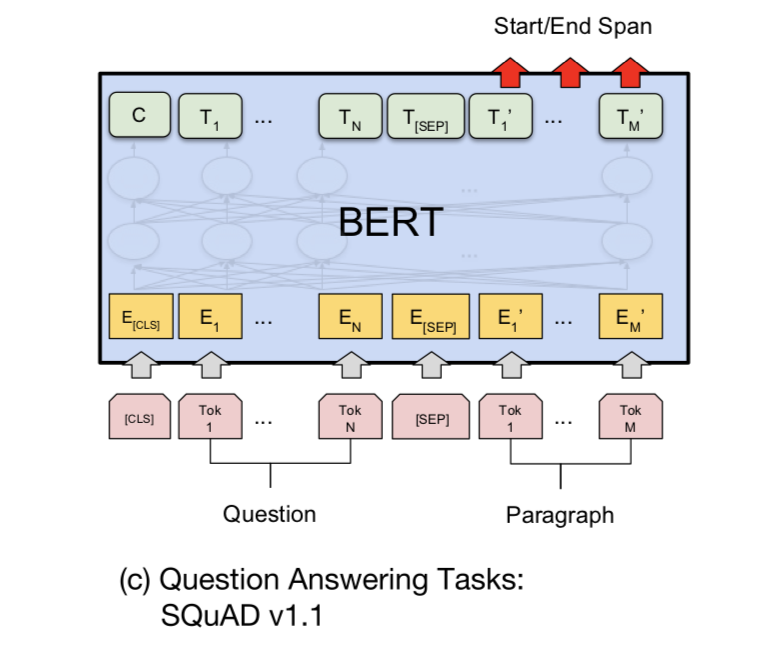
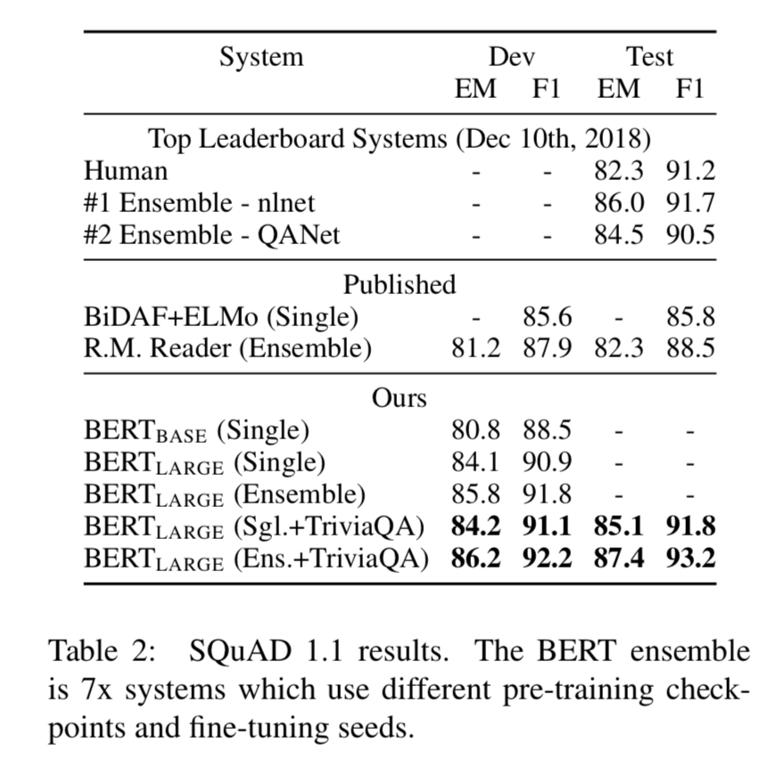
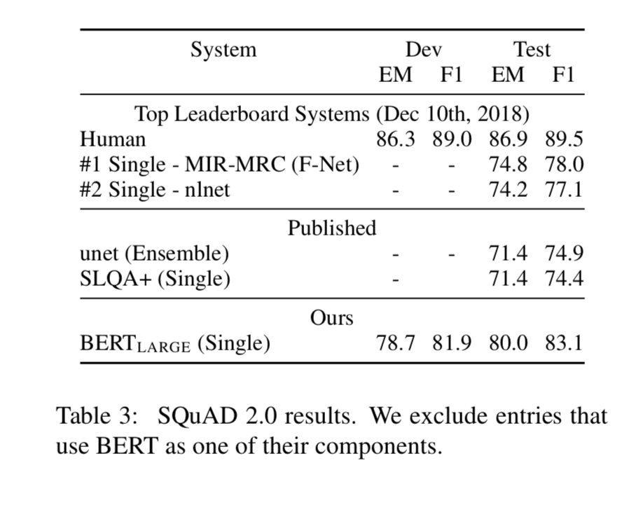
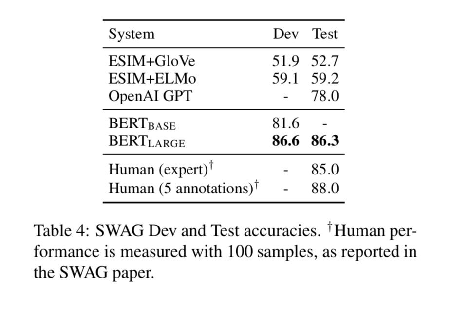
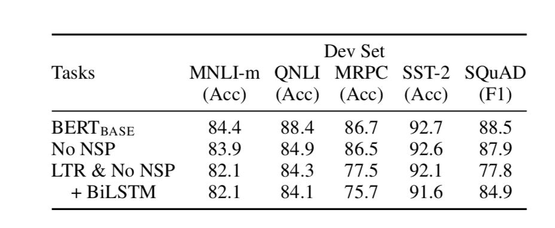
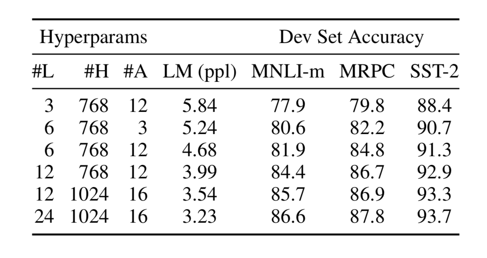
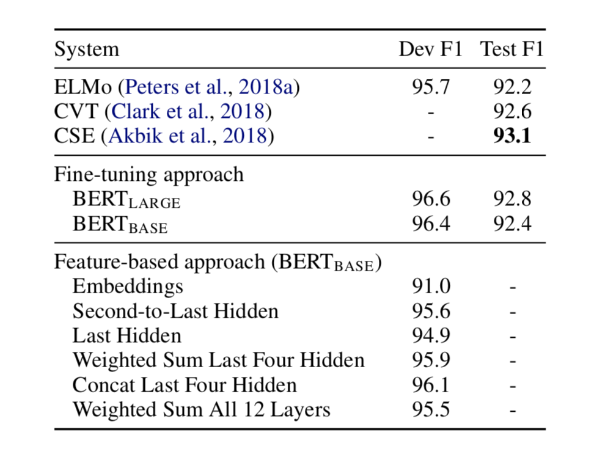

# BERT: Pre-training of Deep Bidirectional Transformers for Language Understanding

+ [source](https://arxiv.org/pdf/1810.04805.pdf)

## 1. Introduction

### 1.1 Two major strategies for applying pre-trained lanauge representation

+ #### Feature-Based Approach

  + ELMo includes the pre-trained representations as additional features

+  #### Fine-Tuning

  + GPT updates all pre-trained parameters while training on the downstream tasks

### 1.2. Limitation of Existing Approaches(GPT)

+ #### Unidirectionality

  + GPT uses only a left-to-right architecture, where every token can only attend to previous tokens in the self-attention layers of the Transformer
  + sub-optimal for sentence-level tasks

### 1.3. Contribution of BERT

+ #### vs. GPT: Overcomes the contraints by Unidirectionality 

  + **MLM**: masked language modeling

  > The masked language model **randomly masks** some of the tokens from the input and the objective is to **predict the original voacabulary id** of the maked word based only on its context

  + **Next Sentence Prediction Task**: jointly pretrains text-pair representations

+ #### vs. ELMo: Deeper 

  + ELMo usesa shallow concatentation of independently trained biLMs.

+ #### SOTA

  + The fist fine-tuning based representation model that achieves SOTA performance on a large suite of sentence-level and token-level tasks. 
  + 11 nlp tasks

## 2. Related work

### 2.1. Unsupervised Feature-based Approaches (such as ELMo)

+ Pre-trained word embeddings, sentence embedding, paragraph embedding
+ ELMo: generalize traditional word embedding research along a different dimension
  + extract context-sensitive features using biLM.

### 2.2. Unsupervised Fine-Tuning Appraches(such as GPT)

### 2.3. Transfer Learning from Supervised Data(such as ImageNet)

## 3. BERT

### 3.1. Model Architecture

+ BERT's model architecture is a multi-layer bidirectional Transformer encoder

|            | the number of layers(L) | the hidden size(H) | the number of self-attention heads(A) | Total Params |
| ---------- | ----------------------- | ------------------ | ------------------------------------- | ------------ |
| BERT_BASE  | 12                      | 768                | 12                                    | 110M         |
| BERT_LARGE | 24                      | 1024               | 16                                    | 340M         |

+ Since it adopted Transformer **encoder**, it is bidirectional
+ In case of GPT, it adopted Transformer decoder, every token of which can only attend to context to its left.

### 3.2. Input/Output Representations

+ In order to handle **miscellaneous down-stream tasks**, both a single sentence and a pair of sentences(QA) should be clearly represented by our input representation

+ Definition of Sentence and Sequence in this paper

  + sentence: an **arbitrary** span of contiguous text, rather than an actual linguistic sentence
  + sequence: **input token sequence** to BERT, which may be a single sentence or two sentences packed together

+ Embedding 

  

  + WordPiece embedding with a 30,000 token vocab.
  + \[CLS]: The first token of every sequece is always a special classification token.
    The final hidden state corresponding to this token is used as the aggregate sequence representation for classification tasks.  
  + \[SEP]: a special token that separate sentence pairs packed together into a single sequence
  + Segment Embedding: Adding a learned embedding to every token indicating whether it belongs to sentence A or sentence B. 
    Add 0 if a token belongs to sentence A; Add 1 if a token belongs to sentence B

  > E: Input Embedding
  >
  > C: the final hidden state of the special \[CLS] token, the length of which equals H
  >
  > T[i]: the final hidden vector for the i***th*** input token, the length of which equals H

  + [Visualized Explanation of Embedding Layers](https://medium.com/@_init_/why-bert-has-3-embedding-layers-and-their-implementation-details-9c261108e28a)

## 4. Traning Procedure 

### 4.1. Pre-training

+ **MLM**(Masked LM)

  + In order to train a deep bidirectional representation, BERT simply mask some percentage of the input tokens at random and the predict those masked tokens. 
  + The final hidden vectors corresponding to the mask tokens are fed into an output softmax over the vocabulary. 
  + BERT mask 15% of all WordPiece tokens in each sequence at random. 

  | Downside                                                     | Solution                                                     | Effect                                                       |
  | ------------------------------------------------------------ | ------------------------------------------------------------ | ------------------------------------------------------------ |
  | Mismatch between pre-training and fine-tuning. [Mask] does not appear in downstrean tasks | Not always mask tokens with [Mask] - 80%: [Mask] - 10%: random token - 10%: unchanged | - The Model is forced to keep  a distributional contextual representation of *every* input token since the model doesn't  which token will be asked to predict or  which is replace by a random word - The small portion of  random replacement allows the model to keep its language understanding capability intact. |

+ **NSP**(Next Sentence Prediction)

  + Language modeling can **scarcely** cover tasks which require understadning **the relationship between two sentences**, such as Question Answering and Natural Langugae Inference tasks
  + Binarized Next Sentence Prediction Task
    + label: [IsNext] or [NotNext]
    + ***C*** is used for next sentence prediction
    + **Fine-tuning is necessary** so as ***C*** to be a meaningful sentence representation for QA and NLI tasks

+ **DATA** 

  + BooksCorpus(800M words)
  + English Wikipedia(2500M words) : only text passages
  + Billion Word Benchmark: document-level corpus

+ **Procedure**

  + Traning Set: Sampled two spans of text from the corpus
    + 50%: consecutive sentences
    + 50%: random sentences
  + Sequence Length: less than 512 tokens
  + Batch Size: 256 sequences
  + Traning steps: 1M steps
  + Optimizer: Adam
  + Dropout: 10% of all layers
  + Activation: gelu activation

### 4.2 Fine-tuning

+ Plug in the task-specific inputs and outputs into BERT, and fine-tune all the parameters **end-to-end**
+ Sentence A and Sentence B at the Input is similar to:
  1. sentence pairs in paraphrasing
  2. hypothesis-premise pairs in entailment
  3. question-passage paris in question answering
  4. degenerate text-∅ pair in text classification or sequence tagging
+ At the output:
  1. **For token-level tasks** , such as sequence tagging or question answering, **the token representations** are fed into an output layer.
  2. **For classification**, such as entailment or sentiment analysis, **the [CLS] representation** is fed into an output layer. 

## 5. Experiments

### 5.1. GLUE(the General Language Understanding Evaluation)

| Task Name                                            | Task                                         | Input                                       | Ouput                                                        | Metric                                          |
| ---------------------------------------------------- | -------------------------------------------- | ------------------------------------------- | ------------------------------------------------------------ | ----------------------------------------------- |
| MNLI Multi_Genre Natural Language Inference     | entailment classification                    | a pair of sentences                         | classify whether the second sentence is an ***entailment(i.e sufficient condition), contradiction, or neutral*** w.r.t the first sentece | Acc                                             |
| QQP Quora Question Pairs                        | binary classification (text similarity)      | a pair of sentences(two questions)          | classify whether two questions are semantically equivalent   | F1                                              |
| QNLI Question Natural Language Inference        | binary classification                        | a pair of sentences(question, sentence)     | classify whether the sentence contain answer for the question | Acc                                             |
| SST-2 the Standford Sentiment Treebank          | binary single-sentence classification        | a sentence(English) from movie reviews      | classify whether the sentence is positive or negative        | Acc                                             |
| CoLA the Corpus of Linguistic Acceptability     | binary classification                        | a sentence                                  | classify whether the sentence is liguistically acceptable    | Acc                                             |
| STS-B the Sentence Textual Similarity Benchmark | Prediction(0-5 scale)                        | a pair of sentences                         | Predict the semantically similarity of two sentences with a score from 0 to 5 | Spearman  Correlation (Robust to outliers) |
| MRPC Microsoft Research Paraphrase Corpus       | binary classification (text similarity) | a pair of sentences from online news source | classify whether the sentences are semantically equivalent   | F1                                              |
| RTE Recognizing Textual Entailment              | binary classification                        | a pair of sentences                         | classify whether one sentence is entailment of the other.    | Acc                                             |
| WNLI Winograd NLI                               | ***excluded***                               |                                             |                                                              |                                                 |

+ **Fine-tuning**

   

  + Final hidden verctor C, corresponding to [CLS] is used 

  + New Parameter: W, the shape of which is (K, H)

    > K: the number of labels
    >
    > H: the hidden vector size

  + Batch_Size= 32, Epoch=3

  + On small datasets, BERT developers ran several random restarts and selected the best model on the Dev set

  + Score

  

### 5.2. SQuAD v1.1

+ the Standford Question Answering Dataset

+ a collection of 100k crowd-sourced question/answer pairs

  | Task               | Input                                                        | Output                         | Metric                                                       |
  | ------------------ | ------------------------------------------------------------ | ------------------------------ | ------------------------------------------------------------ |
  | Question Answering | a pair of a question and a Wiki passage that contains the answer | the answer span in the passage | EM(Exact Match),  F1 [Detailed Info](https://arxiv.org/pdf/1606.05250.pdf) |

  

+ New parameters: **S**(start vector), **E**(end vector), the size of which is (H,)

  + P(Tok i == start) = softmax([dot(T[i],S) for i in range(M)])
  + P(Tok j == end) = softmax([dot(T[j], E) for j in range(M)])
  + start/end span = argmax(dot(T[i], S) + dot(T[j], E)) 
                                   s.t. j>=i

+ Epoch: 3

+ Batch_Size: 32

+ result

  

  + Some models are fine-tuned on TriviaQA before fine-tuned on SQuAD

### 5.3. SQuAD v2.0

+ Compared to v1.1, v2.0 made the problem more realistic

  + no short answer exists in the provided paragraph

+ Applied more regulation when predicting the start and end tokens

  + the score for no-answer span: 
    s[null] = dot(S, C)+dot(E, C) , where C is the last representation of [CLS]
  + start/end span = argmax(dot(T[i], S) + dot(T[j], E)) 
                                    s.t. j>=i, **max(dot(T[i], S) + dot(T[j], E))> s[null] + τ **
  + Epoch: 2
  + Batch_Size: 48

+ result

  

### 5.4. SWAG

+ the Situation With Adversarial Generations
+ the dataset contrains 113K sentence-pair completion examples
+ this challenge evaluates grounded commonsense inference
+ Given a sentence. the task is to choose the most plausible continuation among four choices

| Task                  | Input                                                        | output                                                       | metric |
| --------------------- | ------------------------------------------------------------ | ------------------------------------------------------------ | ------ |
| Binary Classification | the Concatenation of sentence A and sentence B - sentence A: the given sentence - sentence B: a possible continuation (one out of 4 options in the dataset) | the score that tells the possiblity that sentence B might come after sentence A | Acc    |

+ Parameters:

  + a vector whose dot product with [CLS] yields the output
  + Epoch: 3
  + Batch_Size: 16

+ Result

  

## 6. Ablation Studies

> An **ablation study** typically refers to removing some “feature” of the model or algorithm and seeing how that affects performance.

### 6.1. Effect of Pre-training Tasks

+ No NSP
  - A bidirectional model trained using the MLM(Masked Language Model) but w/o the NSP(Next Sentence Prediction) task
+ LTR & No NSP (similar to GPT)
  + A left-context-only model trained using a standard LRT(Left-to-Right) LM
  + Trained w/o NSP task.

+  BERT_base vs. No NSP
  + shows the importance of NSP tasks when pretraining
+ No NSP vs. LTR&No NSP
  + shows the importance of bidirectional representation
+ +BiLSTM
  + Adding BiLSTM layer to LTR&No NSP in order to make it perform better on SQuAD task
  + While SQuAD score improved significantly, the overall GLUE score gets hurt
+ Concat LTR and RTL (similar to ELMo)
  + twice as expensive as a single BERT
  + non-intuitive for tasks like QA
  + less powerful than a deep bidirectional model, since it can use both left and right context at every layer.

### 6.2. Effect of Model Size

+ LM(ppl): Language Model Perplexity
+ Large Models are belived to perform better on large-scale tasks such as machine translation
+ Small tasks can take advantage of large models when the fine-tuning approach is adopted with moderate amount of additional parameters.

### 6.3. Feature-based Approach with BERT

+ Advantages of Featrue-based Approach

  + Some tasks require a task-specific model architecture. Transformer is not a ***panacea***
  + Computaional benefits. No need to train the large model. 

+ Applying BERT to CoNLL-2003, NER(Named Entity Recognition) task

  + CoNLL-2003 task

    | Task | Input      | Output                                                       | Metric |
    | ---- | ---------- | ------------------------------------------------------------ | ------ |
    | NER  | A sentence | IOB tagging [ORG]: organizations [PER] : persons [LOC]: locations [MISC]: Miscellaneous | F1     |

    

    + Example

    

  + Result

### 6.4. Effect of Number of Training Steps

+ The large amount of pretraining steps are justified

### 6.5. Effect of Different Masking Procedures

+ For the feature-based approach, the paper concatenate the last 4 layers of BERT as the features
+ Fine-tuning approach show the robustness over different strategies.

## 7. Comparison of BERT, ELMo, GPT

|                    | BERT                                                         | GPT                                        | ELMo          |
| ------------------ | ------------------------------------------------------------ | ------------------------------------------ | ------------- |
| Approach           | Fine-tuning                                                  | Fine-tuning                                | Feature-based |
| Model Architecture | **bidirectional** Transformer (Encoder)                 | Unidirectional Transformer (Decoder)  | biLSTM        |
| Training           | BooksCorpus(800M) Wikipedia(2500M)                      | BooksCorpus(800M)                          |               |
| Metatokens         | learns [SEP], [CLS], sentence A/B embedding during pre-training | introduces [SEP], [CLS] during fine-tuning |               |
| Training_Step      | 1M steps                                                     | 1M steps                                   |               |
| Batch_Size         | 12,800 words                                                 | 32,000 words                               |               |
| Learning_Rate      | different from task to task                                  | Identical for all fine-tuning experiment   |               |

